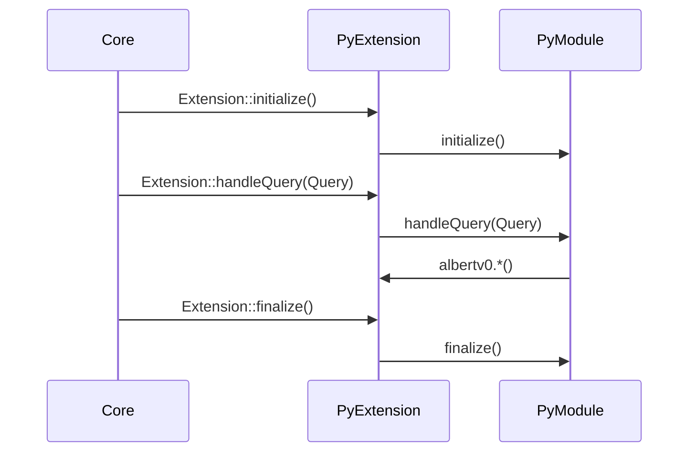

To work as an albert extension Python modules have to have a particular interface described below. The Python extension also defines an embedded module `albertv0` (`albert` in future) which allows the Python modules to interact with the core. The interface specification and the built-in albert module are versioned together and form the versioned Python interface. The Python interface is _not_ final. They are prototypes and intended to be improved on user feedback.

## The Python module interface

This is the metadata albert reads from your module:

Variable | Description
--- | ---
`__iid__`|**Mandatory variable** (string). This variable has to hold the interface version the extension implements.
`__doc__`|The docstring of the module is used as description of the extension. This string will be displayed to the user.
`__prettyname__`|Optional variable (string). This variable should hold the pretty name of the extension. This string will be displayed to the user.
`__version__`|Optional variable (string). This variable should hold the version of the extension. This string will be displayed to the user. The versioning scheme should follow the [semantic versioning](http://semver.org).
`__trigger__`|Optional variable (string). If this extension should be run exclusively, this variable has to hold the trigger that causes the extension to be executed.
`__author__`|Optional variable (string). This variable should hold the name of the author of the extension.
`__dependencies__`|Optional variable (list of strings). This string should contain any dependencies the extension needs to be used.

These are the functions an albert extension must/may have:

Function | Description
--- | ---
`handleQuery(Query)`|**Mandatory function**. This is the crucial part of a Python module. When the user types a query, this function is called with a query object representing the current query execution. This function should return a list of Item objects. See the Item class section below.
`initialize()`|Optional function. This function is called when the extension is loaded. Although you could technically run your initialization code in global scope, it is recommended to initialize your extension in this function. If your extension fails to initialize you can raise exceptions here, which are displayed to the user.
`finalize()`|Optional function. This function is called when the extension is unloaded.


<!--
Also check this sequence diagramm to quickly grasp how the Python extension works:
 https://mermaid-js.github.io/mermaid-live-editor/



-->

## The built-in `albertv0` module

The built-in albert module exposes several functions and classes for use with Albert.

## Functions

Function | Description
--- | ---
`debug(text)`|Log a debug message. Note that this is effectively a NOP in release builds.
`info(text)`|Log an info message.
`warning(text)`|Log a warning message.
`critical(text)`|Log a critical message.
`iconLookup(iconName)`|Perform xdg icon lookup and return a path. Empty if nothing found.
`cacheLocation()`|Returns the writable cache location of the app. (E.g. $HOME/.cache/albert/ on Linux)
`configLocation()`|Returns the writable config location of the app. (E.g. $HOME/.config/albert/ on Linux)
`dataLocation()`|Returns the writable data location of the app. (E.g. $HOME/.local/share/albert/ on Linux)

### The `Query` class

The query class represents a query execution. It holds the necessary information to handle a Query. It is passed to the handleQuery function. It holds the following read-only properties.

Attribute | Description
--- | ---
`string`|This is the actual query string without the trigger. If the query is not triggered this string equals rawstring.
`rawString`|This is the full query string including the trigger. If the query is not triggered this string equals string.
`trigger`|This is the trigger that has been used to start this extension.
`isTriggered`|Indicates that this query has been triggered.
`isValid`|This flag indicates if the query is valid. A query is valid untill the query manager cancels it. You should regularly check this flag and abort the query handling if the flag is `False` to release threads in the threadpool for the next query.

### The `Item` class

The base class for all items is `ItemBase`. This is a wrapper for the internal Item interface. You should not need this unless you need the `Urgency` enum. The `Urgency` enum is defined in the `ItemBase` namespace and has the following enum members: `Alert`, `Notification` and `Normal`. The `Item` class represents a result item. Objects of this class are intended to be returned by the handleQuery function. The signature of the constructor is as follows:

```python
Item(id="", icon=":python_module", text="", subtext="",
     completion="", urgency=Urgency.Normal, actions=[])
```

Note that the default icon path is `:python_module` which is an embedded resource icon depicting a Python script and the urgency defaults to normal.

Attribute | Description
--- | ---
`id`|The identifier string of the item. It is used for ranking algorithms and should not be empty.
`icon`|The path of the icon displayed in the item.
`text`|The primary text of the item.
`subtext`|The secondary text of the item. This text should have informative character.
`completion`|The completion string of the item. This string will be used to replace the input line when the user hits the Tab key on an item. Note that the semantics may vary depending in the context. Often evaluate semantics are more appropriate.
`urgency`|The urgency of the item. Note that the Urgency enum is defined in the ItemBase class. See the Urgency enum.
`addAction(Action)`|Add an action to the item.

### Action classes

The base class for all actions is `ActionBase`. This is a wrapper for the internal Action interface. You should not need it ( If you think you do I‘d be interested why. Please contact me in this case.). There is also a set of standard actions subclassing `ActionBase` which should cover virtually every usecases.

Attribute | Description
--- | ---
`ClipAction`|This class copies the given text to the clipboard on activation.
`UrlAction`|This class opens the given URL with the systems default URL handler for the scheme of the URL on activation.
`ProcAction`|This class executes the given commandline as a detached process on activation. Optionally the working directory of the process can be set.
`TermAction`|This class executes the given commandline in the terminal set in the preferences. Optionally the working directory of the process can be set. The namespace of the `TermAction` also contains an enum `CloseBehavior` with the enum members `CloseOnSucces`, `CloseOnExit` and `DoNotClose`, which can be used to specify the desired behavior on command termination.
`FuncAction`|This class is a general purpose action. On activation the callable is executed.

```python
# Some action examples
ClipAction(text='This action description',
           clipboardText='This goes to the cb')

UrlAction(text='This simply opens google',
          url='https://www.google.com/')

ProcAction(text='This action runs sth.',
           commandline=['jupyter', 'notebook'],
           cwd='notebooks/nb1')

TermAction(text='This action runs sth in terminal.',
           commandline=['jupyter', 'notebook'],
           cwd='~/notebooks/nb1',
           shell=True,
           behavior=TermAction.CloseBehavior.DoNotClose)

def do_sth():
     albert.info("Hello on stdout!")

FuncAction(text="Prints Hello on stdout!", callable=do_sth)

# An item example
Item(id='google',
     text='Google the query',
     subtext='Handy shortcut to google the query',
     actions=[
          UrlAction(text='This simply opens a google search',
                    url='https://www.google.com/search?q=%s' % query.string)
          ClipAction(text='Nifty for dudes assuming you are Google',
                     clipboardText='Dude, https://www.google.com/search?q=%s')
     ])
```
