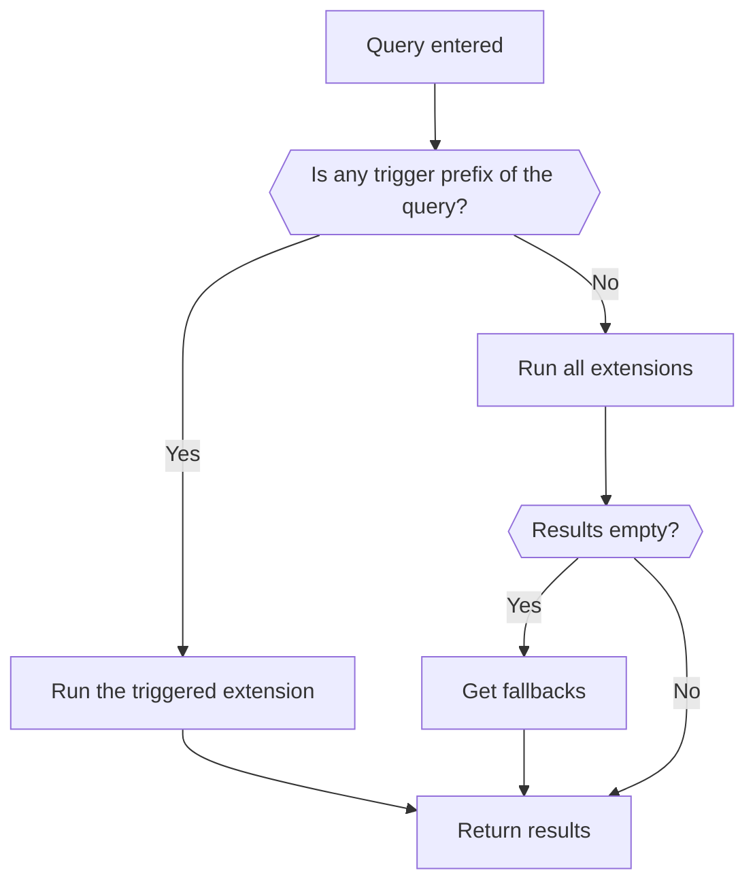

Albert has a flexible nested extension system, which gives users and developers the ability to extend its functionality.

## Native extensions

The native and primary way is to use C++/Qt to write a QPlugin. This gives you the performance of C++, the full set of interfaces to implement, access to several utility classes and direct access to the application and Qt framework including the event loop, which allows asynchronous operations. If you want to write a native extension, check the docs on [native extension](https://github.com/albertlauncher/plugins/blob/master/README.md). Check the [`plugins`](https://github.com/albertlauncher/plugins) repo for an up to date list of extensions.

C++ knowledge is not that widespread therefore there are (native) extensions which make albert scriptable.

## Python extensions

The primary way to script albert is the Python extension. The Python extension adds functionality via Python modules. Most of the community effort goes into this part of the project. It supports a good fraction of the internal API, is in memory and pretty fast. If you want to write a Python extension, check the docs of the [Python plugin](https://github.com/albertlauncher/plugins/blob/master/python/README.md). Check the [`python`](https://github.com/albertlauncher/plugins/) repo for an up to date list of extensions.

## External extensions

A more flexible but less performant and convenient way to extend Albert are external extensions. Since they are basically CGI executables you can use *any* language that can be used to build executable files. This way to extend albert is officially deprecated but stays for backward compatibility. If you plan to write an extension now it is recommended to use the native or Python approach. If you want to write an external extension, check the docs of the [external extension plugin](https://github.com/albertlauncher/plugins/blob/master/externalextensions/README.md). Check the [`external`](https://github.com/albertlauncher/external) repo for a template extension.

## Concepts

## Official extensions

<ul>
  
    <li><a href="{{ plugin.url }}">{{ plugin.title }}</a></li>
  
</ul>
