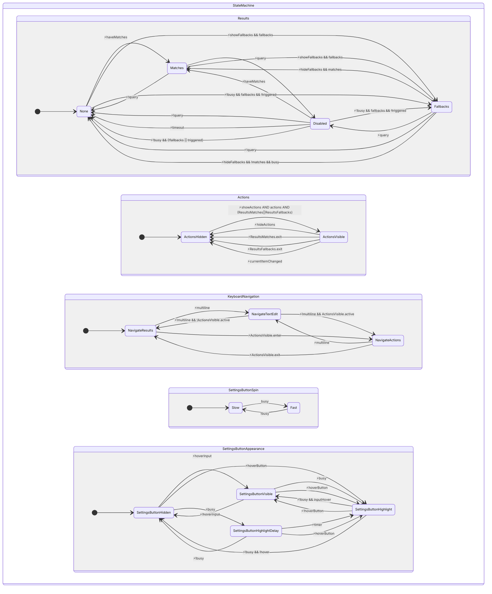

# {{ page.title }}

## Frontend state machine

```mermaid
%%{init: {'theme': 'default', 'themeVariables': { 'fontSize': '9px', 'fontFamily': 'Inter' }}}%%

stateDiagram-v2

state StateMachine {
    direction LR
    state Results {
        direction LR
        state "None" as ResultsHidden
        state "Matches" as ResultsMatches
        state "Fallbacks" as ResultsFallbacks
        state "Disabled" as ResultsDisabled

        [*] --> ResultsHidden
        
        ResultsHidden --> ResultsMatches: ⚡️haveMatches
        ResultsHidden --> ResultsFallbacks: ⚡️showFallbacks && fallbacks
        ResultsHidden --> ResultsFallbacks: ⚡️!busy && fallbacks && !triggered

        ResultsMatches --> ResultsHidden: ⚡️!query
        ResultsMatches --> ResultsDisabled: ⚡️query
        ResultsMatches --> ResultsFallbacks: ⚡️showFallbacks && fallbacks

        ResultsFallbacks --> ResultsHidden: ⚡️!query
        ResultsFallbacks --> ResultsDisabled: ⚡️query
        ResultsFallbacks --> ResultsMatches: ⚡️hideFallbacks && matches
        ResultsFallbacks --> ResultsHidden: ⚡️hideFallbacks && !matches && busy

        ResultsDisabled --> ResultsHidden: ⚡️!query
        ResultsDisabled --> ResultsHidden: ⚡️timeout
        ResultsDisabled --> ResultsHidden: ⚡️!busy && (!fallbacks || triggered)
        ResultsDisabled --> ResultsFallbacks: ⚡️!busy && fallbacks && !triggered
        ResultsDisabled --> ResultsMatches: ⚡️haveMatches
    }

    state Actions {
        direction LR
        [*] --> ActionsHidden
        ActionsHidden --> ActionsVisible: ⚡️showActions AND actions AND (ResultsMatches||ResultsFallbacks)
        ActionsVisible --> ActionsHidden: ⚡️hideActions
        ActionsVisible --> ActionsHidden: ⚡️ResultsMatches.exit
        ActionsVisible --> ActionsHidden: ⚡️ResultsFallbacks.exit
        ActionsVisible --> ActionsHidden: ⚡️currentItemChanged
    }

    state KeyboardNavigation {
        direction LR
        [*] --> NavigateResults
        NavigateResults --> NavigateTextEdit: ⚡️multiline
        NavigateActions --> NavigateTextEdit: ⚡️multiline

        NavigateTextEdit --> NavigateResults: ⚡️!multiline && !ActionsVisible.active
        NavigateTextEdit --> NavigateActions: ⚡️!multiline && ActionsVisible.active

        NavigateResults --> NavigateActions: ⚡️ActionsVisible.enter
        NavigateActions --> NavigateResults: ⚡️ActionsVisible.exit
    }

    state SettingsButtonSpin {
        direction LR
        [*] --> Slow
        Slow --> Fast: busy
        Fast --> Slow: !busy
    }   

    state SettingsButtonAppearance {
        direction LR
        [*] --> SettingsButtonHidden
        SettingsButtonHidden --> SettingsButtonVisible: ⚡️hoverInput
        SettingsButtonHidden --> SettingsButtonHighlight: ⚡️hoverButton
        SettingsButtonHidden --> SettingsButtonHighlightDelay: ⚡️busy
        
        SettingsButtonVisible --> SettingsButtonHidden: ⚡️!hoverInput
        SettingsButtonVisible --> SettingsButtonHighlight: ⚡️busy
        SettingsButtonVisible --> SettingsButtonHighlight: ⚡️hoverButton
        
        SettingsButtonHighlight --> SettingsButtonHidden: ⚡️!busy && !hover
        SettingsButtonHighlight --> SettingsButtonVisible: ⚡️!busy && inputHover
        SettingsButtonHighlight --> SettingsButtonVisible: ⚡️!hoverButton
        
        SettingsButtonHighlightDelay --> SettingsButtonHighlight: ⚡️timer
        SettingsButtonHighlightDelay --> SettingsButtonHighlight: ⚡️hoverButton 
        SettingsButtonHighlightDelay --> SettingsButtonHidden: ⚡️!busy
    }
}
```  